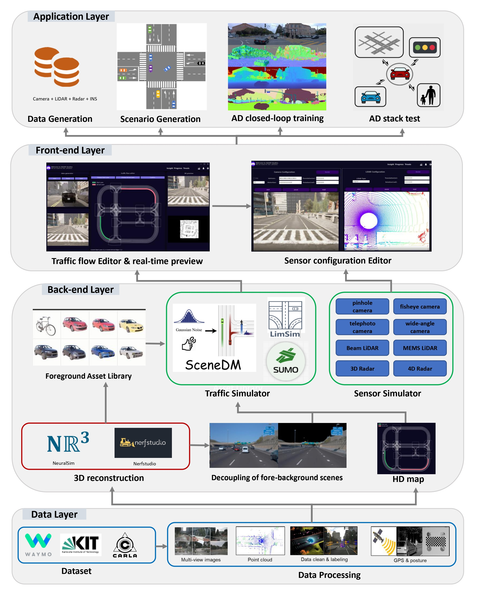

# : an Open and Adaptive Simulator based on Neural Rendering for Autonomous Driving

[](https://arxiv.org/abs/)
[](https://pjlab-adg.github.io/OASim)
[](https://github.com/pjlab-adg/OASim/stargazers)
[](https://github.com/PJLab-ADG/OASim/issues)
[](https://github.com/PJLab-ADG/OASim/pulls)


## 🔍 Framework Overview



OASim focuses on generating new and highly customizable autonomous driving data through neural implicit reconstruction and rendering techniques. This technology has a wealth of applications, such as large-scale data and scene generation, corner case generation, autonomous driving closed-loop training, autonomous driving stack testing, etc.


## 🌟 Highlights
- **`2024-02-08`** Codes are now release!
- **`2024-02-07`** Explore our project page, now live [here](https://pjlab-adg.github.io/OASim)🔗!
- **`2023-02-07`** Our paper is available on [Arxiv](https://arxiv.org/abs/)📄!


## 🚀 Getting Started

First, clone with submodules: 

```shell
git clone git@github.com:PJLab-ADG/OASim.git --recurse-submodules -j8
```
### 1. Installation 📦

Our code is developed on Ubuntu 22.04 using Python 3.9 and PyTorch 2.0 (CUDA 11.8). Please note that the code has only been tested with these specified versions. We recommend using conda for the installation of dependencies. The installation process might take more than 30 minutes.

```bash
conda create -n oasim python=3.9 
conda activate oasim
conda install pytorch==2.0.0 torchvision==0.15.0 torchaudio==2.0.0 pytorch-cuda=11.8 -c pytorch -c nvidia
```
- pytorch_scatter

```shell
conda install pytorch-scatter -c pyg
```

- other pip packages

```shell
pip install opencv-python-headless kornia imagesize omegaconf addict imageio imageio-ffmpeg scikit-image scikit-learn pyyaml pynvml psutil seaborn==0.12.0 trimesh plyfile ninja icecream tqdm plyfile tensorboard PySide6 vtk dash-vtk dearpygui==1.8.0 matplotlib==3.7.1 pandas==2.0.0 pynput==1.7.6 rich==13.4.2 sumolib==1.16.0 traci==1.16.0
```

### 2. Configuration ⚙️ 

`cd` to the `nr3d_lib` directory.

Then: (Notice the trailing dot `.`)

```shell
pip install -v .
```

Download the model file according to the link below.

```
Link (链接): https://pan.baidu.com/s/1AODTuqhmgwbRWxGGCmo0iA 
Extraction code (提取码): 94id
```

### 3. Running OASim

Running OASim is straightforward:
```bash
bash scripts/run_oasim.sh
```
**Note:** Modify `--resume_dir` parameter in run_oasim.sh to the directory of the model file you downloaded.

#### 3D Preview:

First, move the mouse to the 3D preview interface in the upper right part and click the right mouse button. 
Then preview the 3D implicit reconstruction results through the keyboard. The keyboard control method is as follows.

  | Extrinsic Params | Keyboard_input | Extrinsic Params | Keyboard_input |
  | :--------------: | :------------: | :--------------: | :------------: |
  |    +x degree     |       q        |    -x degree     |       a        |
  |    +y degree     |       w        |    -y degree     |       s        |
  |    +z degree     |       e        |    -z degree     |       d        |
  |     +x trans     |       r        |     -x trans     |       f        |
  |     +y trans     |       t        |     -y trans     |       g        |
  |     +z trans     |       y        |     -z trans     |       h        |

#### Traffic flow editor:
First, click the `Choose Start Lane` button in the middle interface, and click on any lane on the HD map to select the starting lane. Then click the `Choose Arrival Lane` button and click on any lane on the HD map to select the destination lane. Finally, click `Confirm` button to generate data.

## 🔖 Citation
If you find our paper and codes useful, please kindly cite us via:

```bibtex

```

## 📝 License
OASim is released under the Apache 2.0 license.
